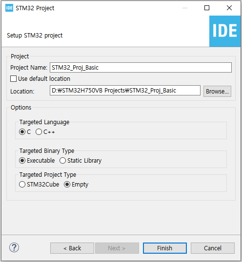
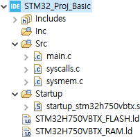
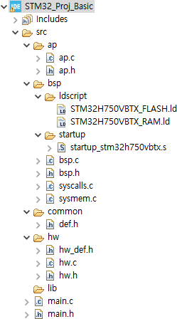
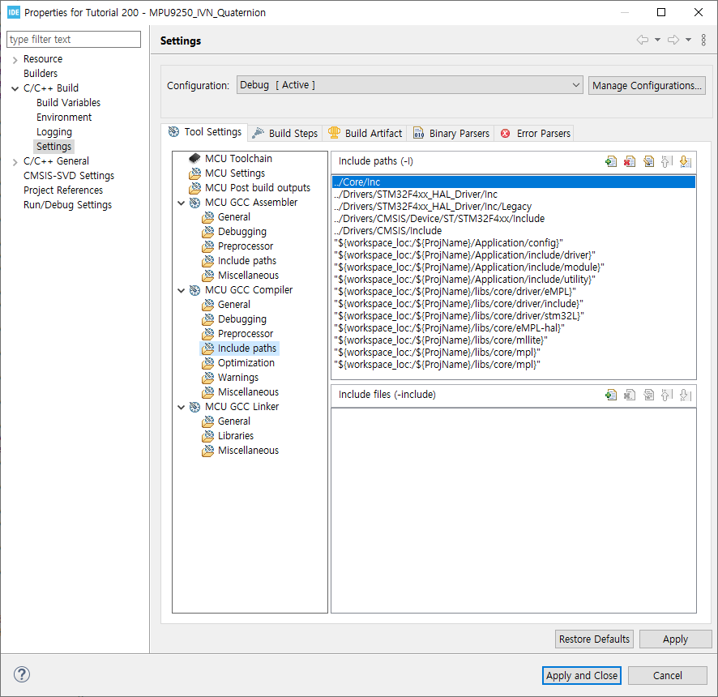
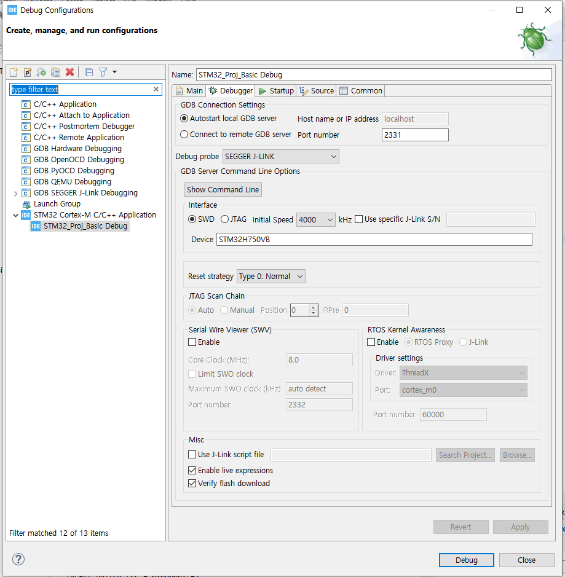

# STM32CubeIDE Basic

## 1. Create new Project

#### - File > New > STM32 Project 

</img>

#### - Beginning folder structure

</img>

#### - Customize folder structure

</img>

#### - Project Path settings

- Proejct > Properties > C/C++ Build > Settings > MCU GCC Compiler > Include paths

</img>

- Linker Script Path change

</img>

#### - Each File code

- main

<main.h>

```c
#ifndef SRC_MAIN_H_
#define SRC_MAIN_H_

#include "ap.h"

#endif /* SRC_MAIN_H_ */
```

<main.c>

```c
#include "main.h"

int main(void)
{
  hwInit();
  apInit();
  apMain();

  return 0;
}
```

<ap.h>

```c
#ifndef SRC_AP_AP_H_
#define SRC_AP_AP_H_

#include "hw.h"

void apInit(void);
void apMain(void);

#endif /* SRC_AP_AP_H_ */
```

<ap.c> - it has main loop(while)

```c
#include "ap.h"

void apInit(void)
{
}

void apMain(void)
{
  while(1)
  {
  }
}
```

<hw.h>

```c
#ifndef SRC_HW_HW_H_
#define SRC_HW_HW_H_

#include "hw_def.h"

void hwInit(void);

#endif /* SRC_HW_HW_H_ */
```

<hw.c>

```c
#include "hw.h"

void hwInit(void)
{
  bspInit();
}
```

<hw_def.h>

```c
#ifndef SRC_HW_HW_DEF_H_
#define SRC_HW_HW_DEF_H_

#include "def.h"
#include "bsp.h"

#endif /* SRC_HW_HW_DEF_H_ */
```

<def.h>

```c
#ifndef SRC_COMMON_DEF_H_
#define SRC_COMMON_DEF_H_

#include <stdio.h>
#include <stdint.h>
#include <stdbool.h>

#endif /* SRC_COMMON_DEF_H_ */

```

#### - Debug Configuration

- Run > Debug Configurations...

    - J-Link Pro Debugging Setting

</img>


