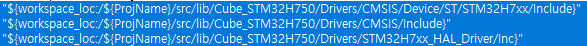
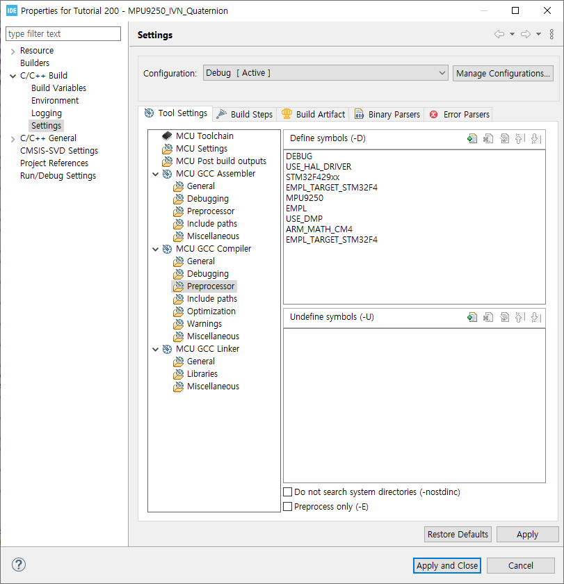

# LED Project

- Add Custom project into Basic project structure

#### 1. Create STM32CubeMX project

- STM32CubeMX project and save into <b>project>src>lib</b> folder

#### 2. Exclude Core folder from Build process

- Project folder > src > lib > Cube_STM32H750 > Core : Mouse right click
- Resource Configurations > Exclude from Build...

#### 3. Add include path

</img>

#### 4. Add MCU type into preprocess

- MCU Type is in the stm32h7xx.h header file list

</img>
