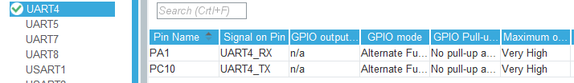

# 02. UART

### <UART 기본설정>

1. UART 포트 선택하고 Enable 한다. ⇒ Asynchronous

</img>

1. UART Parameter values

</img>

1. UART TX

</img>

## <printf>

1. _write 함수 선언

</img>

- &huart4 는 사용하는 uart 포트 임

1. printf 콜

</img>

### <printf float 값 표기>

1. Project > Properties

</img>

1. GCC Linker 추가

</img>

- Properties > C/C++ Build > Settings > Tool Settings > MCU GCC Linker > Miscellaneous
- Other flags 에서 "-u_printf_float" 를 추가한면 printf에서 float값을 출력할 수 있다.

</img>

### <UART RX Interrupt>

1. UART NVIC Settings 설정

</img>

1. NVIC > Code generation > Select for init sequen... 설정

</img>

1. Source Code 에 UART NVIC 가 설정됨

</img>

1. "stm32f4xx_hal_uart.c" 파일에서 __weak void HAL_UART_RxCpltCallback(UART_HandleTypeDef *huart) 을 찾아 사용하고자 하는 곳에 복사붙여넣어 내 코드를 추가한다.

</img>

</img>

- "HAL_UART_Receive_IT"함수는 UART 수신 인터럽트를 걸어 놓는다는 의미이다.
- 그래서 UART 설정이후에 한번 선언하고, 인터럽트가 호출되면 즉시 다음 신호를 위해 다시 선언해야 다음 신호를 받을 수 있다.
