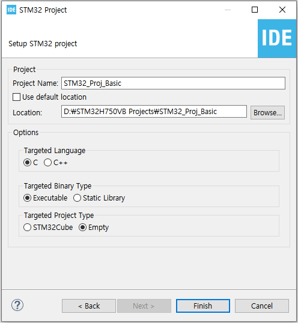
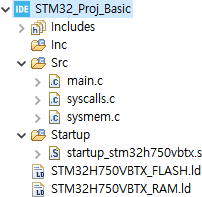
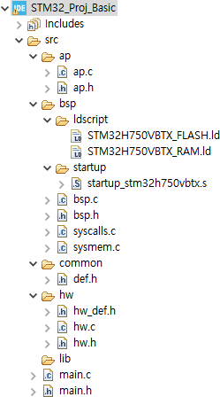
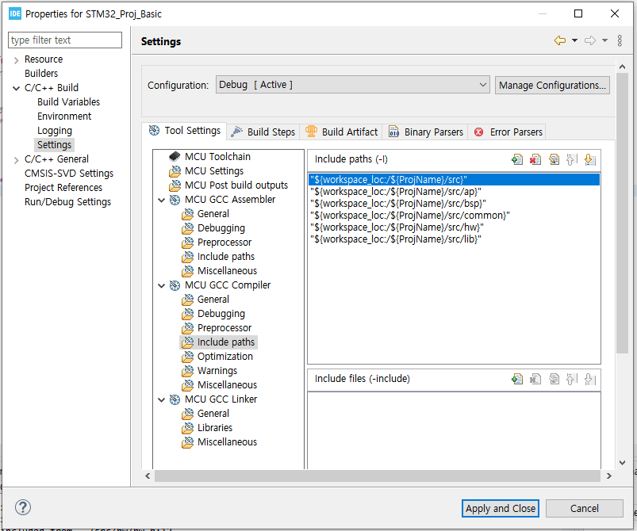

# STM32CubeIDE Basic

## 1. Create new Project

#### - File > New > STM32 Project 

</img>

#### - Beginning folder structure

</img>

#### - Customize folder structure

</img>

#### - Project Path setup

- Proejct > Properties > C/C++ Build > Settings > MCU GCC Compiler > Include paths

</img>

